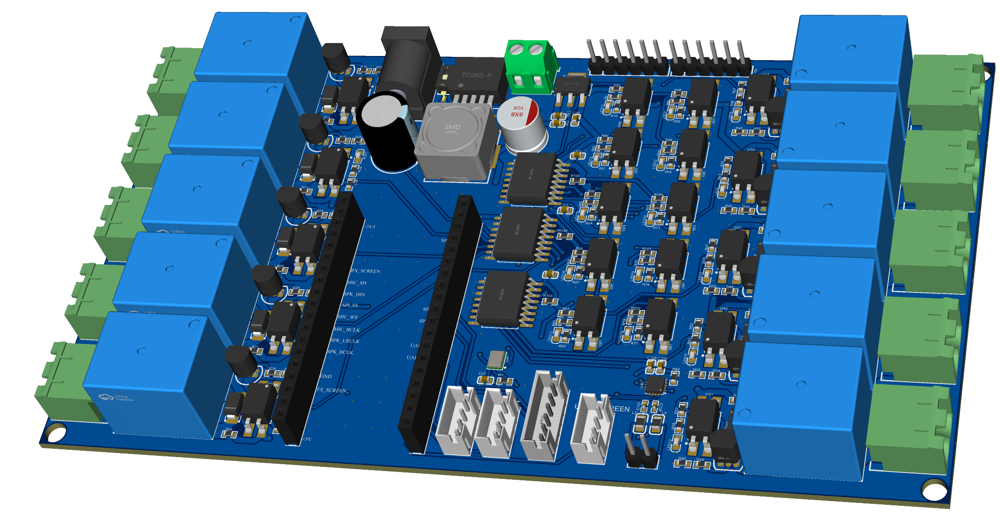
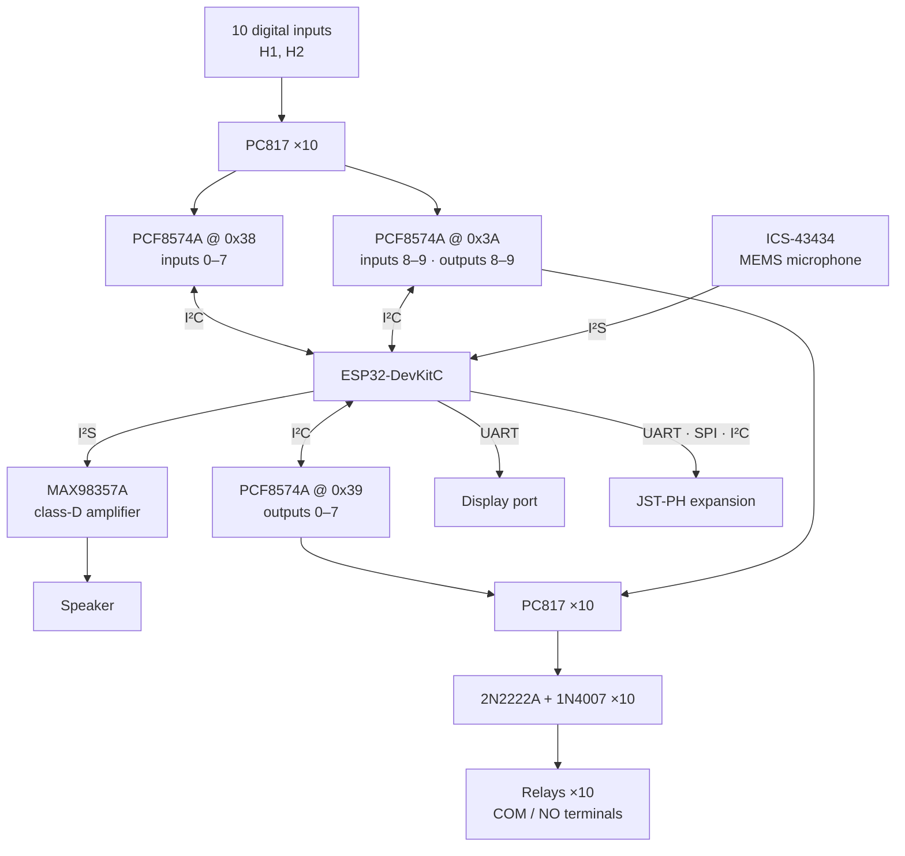
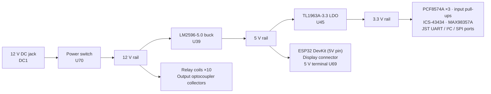

# ESP32 PLC Controller Board

A PLC-style I/O controller designed around a socketed **ESP32-DevKitC (38-pin)**: 10 optocoupler-buffered digital inputs, 10 relay outputs, an on-board 12 V → 5 V → 3.3 V power chain, an I²S audio path (MEMS microphone and class-D speaker amplifier) and JST-PH ports for a UART display, a spare UART, SPI and I²C.

All 20 I/O channels sit behind three PCF8574A I²C port expanders, so the whole I/O block uses only two ESP32 pins (SDA/SCL) and leaves the rest free for audio, display and expansion.

Designed in **EasyEDA Pro**. 4-layer board, 160.9 × 91.2 mm.

## Contents

- [Specifications](#specifications)
- [Block diagram](#block-diagram)
- [Circuit description](#circuit-description)
- [ESP32 pin map](#esp32-pin-map)
- [I²C devices and I/O mapping](#ic-devices-and-io-mapping)
- [Connectors](#connectors)
- [PCB](#pcb)
- [Repository layout](#repository-layout)

## Specifications

| Item | Value |
| --- | --- |
| MCU | ESP32-DevKitC, socketed on 2 × 19-pin headers |
| Supply input | 12 V DC (DC-005 barrel jack), slide power switch |
| Internal rails | 5 V (LM2596 buck, 3 A class), 3.3 V (TL1963A LDO, 1.5 A class) |
| Digital inputs | 10, PC817 optocoupler, status LED per channel |
| Relay outputs | 10 × SRD-12VDC-SL-C, COM + NO on 5.08 mm screw terminals |
| I/O interface | 3 × PCF8574AT on I²C (0x38, 0x39, 0x3A) |
| Audio in | ICS-43434 I²S MEMS microphone |
| Audio out | MAX98357A I²S class-D amplifier, speaker header |
| Expansion | JST-PH: UART display (5 V), UART, I²C, SPI |
| PCB | 4 layers, 160.9 × 91.2 mm, ~1.6 mm, 1 oz outer copper |

## Block diagram

### Power tree

## Circuit description

The schematic has five sheets: Power, 10 inputs + 10 relays, Interfaces, Speaker + Microphone, ESP32.

### 1. Power

- **Input:** 12 V on the DC-005 barrel jack (DC1), switched by U70 and buffered by a 680 µF / 35 V bulk capacitor (C103).
- **5 V rail:** LM2596SX-5.0 buck (U39) with a 33 µH inductor (L1), SS34 catch diode (D11) and 220 µF + 47 µF output capacitors. The 5 V rail feeds the ESP32 DevKit (5V pin), the display connector, the 3.3 V LDO and a 2-pin 3.81 mm terminal (U69).
- **3.3 V rail:** TL1963A-33 LDO (U45) from 5 V, with 47 µF + 10 µF output capacitance. Supplies the PCF8574A expanders, optocoupler pull-ups, microphone, amplifier and the JST ports.
- **12 V rail:** used directly for the relay coils and the collector side of the output optocouplers.

### 2. Digital inputs (×10)

Each input (IN_0…IN_9 on headers H1/H2) drives a PC817 LED through a 220 Ω resistor, with a parallel 470 Ω + LED status indicator. The phototransistor pulls the corresponding PCF8574A pin low; a 4.7 kΩ pull-up to 3.3 V gives a logic high when the input is off. Logic is therefore **inverted**: input active → expander bit reads `0`.

### 3. Relay outputs (×10)

Each output channel runs: PCF8574A pin → 390 Ω → PC817 LED (plus a 2 kΩ + LED status indicator). The PC817 transistor switches 12 V into a 4.7 kΩ / 10 kΩ divider that drives the base of a 2N2222A. The 2N2222A sinks the relay coil (12 V via a 0 Ω link), with a 1N4007 flyback diode across the coil. Each relay's COM and NO contacts are routed with copper fills to a 2-pin 5.08 mm screw terminal; NC is not used.

### 4. Audio

- **Speaker:** MAX98357A (U46) in its default 9 dB gain configuration (GAIN pin open). SD_MODE is pulled up through 10 kΩ, which enables the amplifier and selects the left I²S channel. Outputs go through BLM21 ferrite beads with 220 pF capacitors to the 2-pin speaker header (U48). Powered from 3.3 V.
- **Microphone:** ICS-43434 (U47) with L/R tied low (left channel) and a 100 kΩ pull-down on SD.

### 5. ESP32 and interfaces

The DevKit plugs into H9/H10. I²C, SPI, UART and the display UART are broken out on JST-PH connectors (see [Connectors](#connectors)).

## ESP32 pin map

Header pin numbers follow the standard ESP32-DevKitC V4 38-pin layout.

| Signal | GPIO | Header pin | Notes |
| --- | --- | --- | --- |
| SDA | 21 | H10.6 | I²C to PCF8574A ×3 and I²C port |
| SCL | 22 | H10.3 | I²C |
| SPI_MOSI | 23 | H10.2 | VSPI |
| SPI_MISO | 19 | H10.8 | VSPI |
| SPI_SCLK | 18 | H10.9 | VSPI |
| SPI_SS | 33 | H9.8 | GPIO chip select |
| UART1_TX | 17 | H10.11 | Expansion UART |
| UART1_RX | 16 | H10.12 | Expansion UART |
| TX_SCREEN | 13 | H9.15 | Display UART TX |
| RX_SCREEN | 34 | H9.5 | Display UART RX (input-only pin) |
| SPK_BCLK | 14 | H9.12 | I²S out → MAX98357A |
| SPK_LRCLK | 27 | H9.11 | I²S out |
| SPK_DIN | 32 | H9.7 | I²S out data |
| MIC_BCLK | 26 | H9.10 | I²S in → ICS-43434 |
| MIC_WS | 25 | H9.9 | I²S in |
| MIC_SD | 35 | H9.6 | I²S in data (input-only pin) |

A ready-to-use header with these definitions is in [`firmware/pinmap.h`](firmware/pinmap.h).

## I²C devices and I/O mapping

PCF8574A base address is 0x38; A2..A0 straps set the low bits.

| Expander | Straps (A2 A1 A0) | Address | Function |
| --- | --- | --- | --- |
| U29 | 0 0 0 | **0x38** | Inputs I0–I7 (P0–P7) |
| U31 | 0 0 1 | **0x39** | Outputs O0–O7 (P0–P7) |
| U30 | 0 1 0 | **0x3A** | Inputs I8–I9 (P0–P1), outputs O8–O9 (P2–P3), P4–P7 free |

| Channel | Expander pin | Front-end | Relay / terminal |
| --- | --- | --- | --- |
| IN_0…IN_4 | 0x38 P0…P4 | U59–U63 | header H1 pins 1–5 |
| IN_5…IN_7 | 0x38 P5…P7 | U64–U66 | header H2 pins 1–3 |
| IN_8, IN_9 | 0x3A P0, P1 | U67, U68 | header H2 pins 4–5 |
| O0…O7 | 0x39 P0…P7 | U6–U9, U16, U18, U20, U22 | RELAY1–8 → U49–U56 |
| O8, O9 | 0x3A P2, P3 | U40, U41 | RELAY9–10 → U57, U58 |

## Connectors

| Ref | Type | Pinout |
| --- | --- | --- |
| DC1 | DC-005 jack | 12 V input |
| U69 | 2P 3.81 mm terminal | 1 GND, 2 +5V |
| H1 | 1×6 2.54 mm | 1–5 IN_0…IN_4, 6 GND |
| H2 | 1×6 2.54 mm | 1–5 IN_5…IN_9, 6 GND |
| U49–U58 | 2P 5.08 mm terminals | 1 NO, 2 COM (relays 1–10) |
| U48 | 1×2 2.54 mm | Speaker: 1 R−, 2 R+ |
| UART_SCREEN | JST-PH 4P | 1 +5V, 2 RX_SCREEN, 3 TX_SCREEN, 4 GND |
| UART | JST-PH 4P | 1 +3V3, 2 UART1_TX, 3 UART1_RX, 4 GND |
| I2C | JST-PH 4P | 1 +3V3, 2 SCL, 3 SDA, 4 GND |
| SPI | JST-PH 6P | 1 +3V3, 2 MISO, 3 MOSI, 4 SCLK, 5 SS, 6 GND |

## PCB

| Parameter | Value |
| --- | --- |
| Size | 160.9 × 91.2 mm, 4 mounting holes |
| Layers | 4: Top (signal) / Inner1 (GND plane) / Inner2 (signal + GND pour) / Bottom (signal + GND pour) |
| Stackup | ~1.6 mm, 1 oz outer, ½ oz inner copper |
| Traces | 0.3–0.6 mm signal, 1.0 mm for 12 V / 5 V power |
| Vias | 0.3 mm drill / 0.6 mm pad, 432 total |
| Relay contacts | COM/NO routed as copper fills to the terminals |
| Parts | 201 placed components, 0603 passives |

## Repository layout

| Path | Description |
| --- | --- |
| `hardware/BOM.csv` | Bill of materials with designators and LCSC part numbers (201 parts, 37 lines) |
| `firmware/pinmap.h` | ESP32 pin and I²C address definitions |
| `images/image.png` | 3D render |

## Author

**Orkhan Dadashov** — Electrical and Electronics Engineering, Baku Engineering University & Inha University
